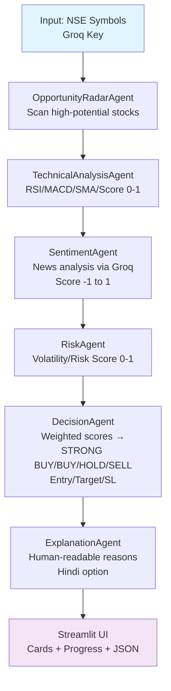

# TradeMind AI 🇮🇳📈

[](https://streamlit.io/)
[](https://python.org)
[](https://langchain.com)
[](https://groq.com)

**Multi-Agent AI Trading Intelligence for Indian Investors**  
*Real-time NSE stock analysis using collaborative AI agents – Opportunity Radar, Technical Analysis, Sentiment, Risk Assessment, Decision Engine & Explainable Insights*

<div align=center>

<!-- Replace with actual screenshot/GIF after running app -->
</div>

## 📋 Table of Contents
- [TradeMind AI 🇮🇳📈](#trademind-ai-)
  - [📋 Table of Contents](#-table-of-contents)
  - [🎯 Why This Project Matters](#-why-this-project-matters)
  - [🚀 Features](#-features)
  - [🎯 Objective](#-objective)
  - [🏗️ Multi-Agent Architecture](#️-multi-agent-architecture)
  - [🔄 Analysis Pipeline](#-analysis-pipeline)
  - [🤖 Specialized Agents](#-specialized-agents)
  - [🧠 Model Strategy](#-model-strategy)
  - [📱 Streamlit UI](#-streamlit-ui)
  - [🛠️ Quick Start](#️-quick-start)
  - [📦 Full Setup](#-full-setup)
    - [Prerequisites](#prerequisites)
    - [TA-Lib (Windows)](#ta-lib-windows)
    - [.env](#env)
    - [Run Production](#run-production)
  - [📊 Input → Output Example](#-input--output-example)
  - [💼 Use Cases](#-use-cases)
  - [🔮 Future Improvements](#-future-improvements)
  - [🔑 Environment Variables](#-environment-variables)
  - [📈 Live Demo](#-live-demo)
  - [🤝 Contributing](#-contributing)
  - [📄 License](#-license)

## 🎯 Why This Project Matters
Indian retail investors face:
- **Information Overload**: Thousands of NSE stocks, endless news.
- **Emotional Trading**: FOMO/FUD leads to poor decisions.
- **Time Constraints**: Can't monitor markets 24/7.
- **Complex Analysis**: Need TA + sentiment + risk in one view.

**TradeMind AI solves this** with *collaborative multi-agent intelligence* – each agent specializes, debates internally via weighted scores, delivers **actionable, explainable recommendations** with entry/target/stop-loss.

**Multi-Agent USP vs Single LLM**:
| Single LLM | Multi-Agent TradeMind |
|------------|-----------------------|
| Hallucinates TA/news | Specialized agents validate each other |
| Generic advice | Weighted scoring (TA:30%, Opp:25%, etc.) |
| Black-box | Step-by-step reasoning + Hindi explanations |
| Slow | Async sentiment + cached data |

## 🚀 Features
- ✅ **6 Specialized Agents** collaborating for robust decisions
- ✅ **NSE-Focused** (yfinance + nsepy support)
- ✅ **Real-Time Data** via yfinance + TA-Lib (RSI, MACD, SMA)
- ✅ **LLM-Powered** sentiment & explanations (Groq Llama3.3 70B)
- ✅ **Interactive Streamlit UI** with confidence meters, price levels
- ✅ **Hindi Explanations** for 1.4B Indians
- ✅ **Portfolio Mode** – analyze your watchlist
- ✅ **JSON Export** for algo-trading
- ✅ **Risk-Aware** with stop-loss & confidence scoring

## 🎯 Objective
Empower Indian investors with **AI-driven, data-backed trading signals** combining:
- Market opportunities scanning
- Technical analysis (RSI/MACD)
- News sentiment
- Risk assessment
- Final decision with precise entry/target/stop-loss

Target: **Short-term trades (1-7 days)** on NSE large/mid-caps.

## 🏗️ Multi-Agent Architecture


## 🔄 Analysis Pipeline
1. **Scan**: Opportunity agent picks promising NSE stocks (vol >50Cr, cap >5k Cr).
2. **TA**: RSI (<30 oversold), MACD hist, SMA crossovers → tech_score (0-1).
3. **Sentiment**: Groq analyzes recent news → sent_score (-1 to 1).
4. **Risk**: Volatility, beta → risk_score (lower better).
5. **Decide**: `final_score = 0.25*opp + 0.30*tech + 0.25*sent + 0.20*(1-risk)`<br/>Thresholds: >0.6 BUY, <0.4 SELL.
6. **Explain**: LLM generates bullet reasons.

Async sentiment for speed.

## 🤖 Specialized Agents
| Agent | Role | Tools/Models |
|-------|------|-------------|
| OpportunityRadar | Scans NSE for momentum/vol | Config NSE list |
| TechnicalAnalysis | RSI(14), MACD, SMA20/50 | TA-Lib, yfinance |
| Sentiment | News sentiment scoring | Groq Llama3.3-70B |
| Risk | Volatility/stop assessment | Historical vol |
| Decision | Weighted aggregation | Rule-based + thresholds |
| Explanation | Natural language reasons | Groq Llama3.3-70B |

## 🧠 Model Strategy
- **Groq Llama3.3-70B-Versatile**: Sentiment (fast inference) & Explanations (high quality).
- **Why Groq**: 500+ tokens/sec, cost-effective for real-time.
- **Fallback**: Configurable to OpenAI.

## 📱 Streamlit UI
- Sidebar: Groq key + portfolio (e.g., `RELIANCE.NS,TCS.NS`)
- Cards: Action (🟢STRONG BUY), Confidence progress bar, Price levels, Reasons expander.
- Hindi toggle for explanations.
- JSON download.


## 🛠️ Quick Start
```bash
# 1. Clone & Install
uv sync  # or pip install -r requirements.txt

# 2. Add .env
echo "GROQ_API_KEY=your_key" > .env

# 3. Run
streamlit run app.py
```

Open [localhost:8501](http://localhost:8501)

## 📦 Full Setup
### Prerequisites
- Python 3.12+
- uv/uvicorn (recommended) or pip

```bash
git clone <repo>
cd TradeMind_AI
uv sync  # Installs langchain, yfinance, ta-lib, streamlit, etc.
```

### TA-Lib (Windows)
```bash
# Pre-built wheel
pip install TA-Lib
# Or conda: conda install -c conda-forge ta-lib
```

### .env
```
GROQ_API_KEY=gsk_xxx  # Required from console.groq.com
```

### Run Production
```bash
streamlit run app.py --server.port 8080 --server.address 0.0.0.0
```

## 📊 Input → Output Example
**Input**: `RELIANCE.NS, TCS.NS` + Groq key

**Output JSON**:
```json
[{
  "stock": "RELIANCE.NS",
  "action": "STRONG BUY",
  "confidence": 78,
  "entry": 2950.5,
  "target": 3050.0,
  "stop_loss": 2880.0,
  "risk_level": "Low",
  "reason": [
    "RSI 28 (Oversold)",
    "MACD bullish crossover",
    "Positive Q3 earnings sentiment"
  ]
}]
```

## 💼 Use Cases
- **Retail Investors**: Daily signal generation.
- **Portfolio Managers**: Batch analysis.
- **Algo Trading**: JSON → execution pipeline.
- **Education**: Learn multi-agent AI + finance.

## 🔮 Future Improvements
- [ ] Add fundamental agent (P/E, ROE via APIs).
- [ ] Options chain analysis.
- [ ] Backtesting module.
- [ ] Telegram/Discord bot.
- [ ] Fine-tuned trading model.
- [ ] Vector DB for historical signals.

## 🔑 Environment Variables
| Key | Required | Description |
|-----|----------|-------------|
| `GROQ_API_KEY` | ✅ | Groq API for LLM agents |

## 📈 Live Demo
Run `streamlit run app.py` – instant NSE analysis!

## 🤝 Contributing
1. Fork & PR
2. `uv sync && pytest`
3. `black . && flake8`

## 📄 License
MIT – Free for commercial use.

---
*Built for Economics Gen AI Hackathon 🚀*

